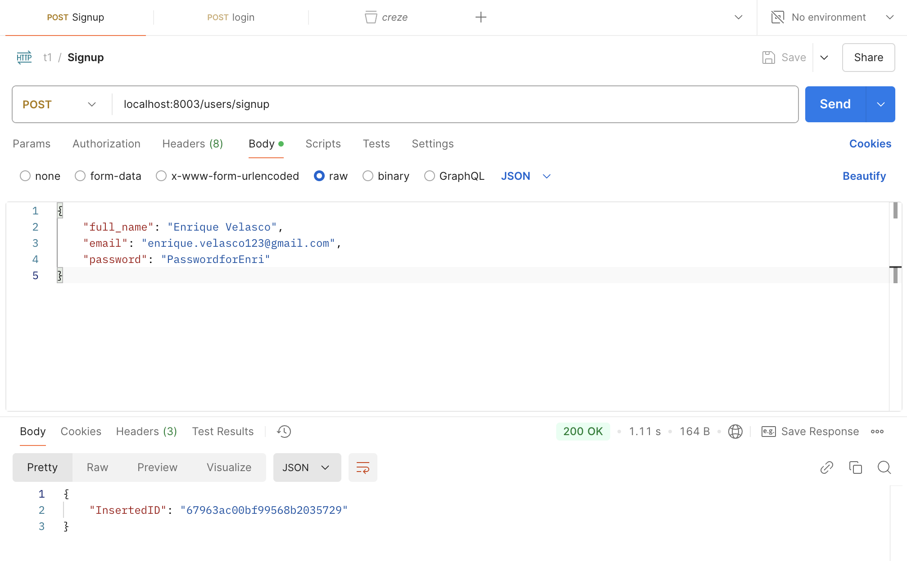
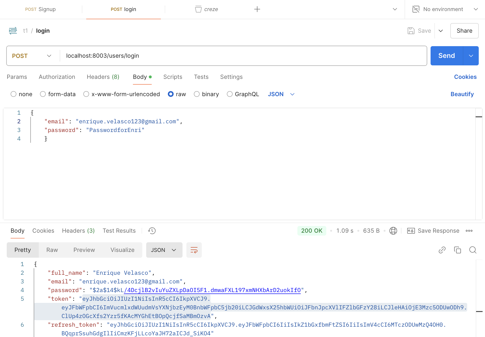
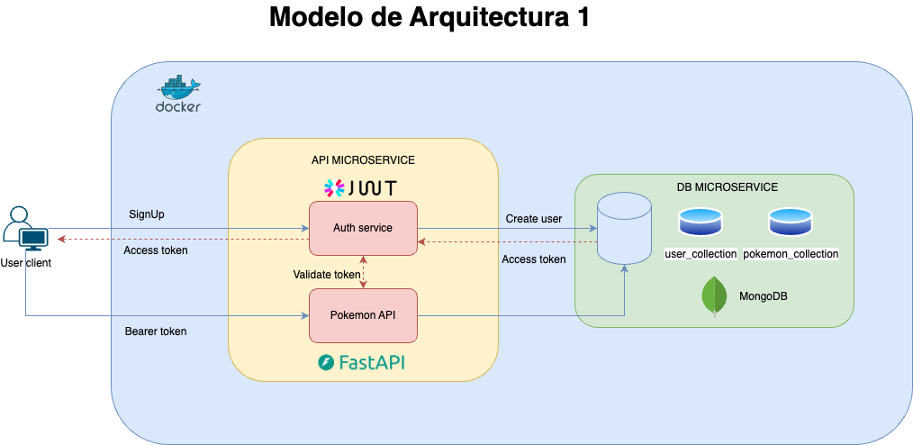
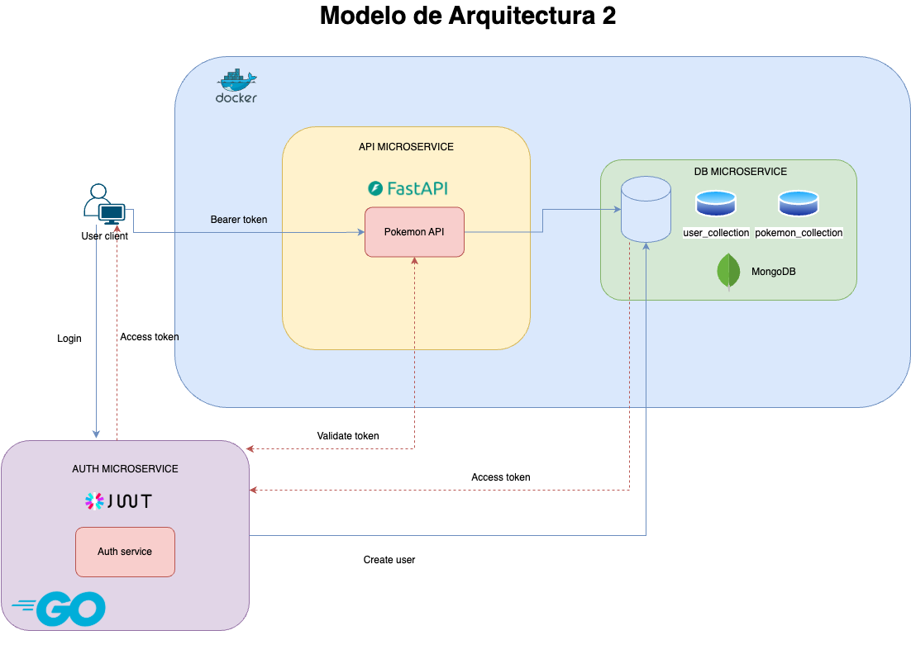

# T1 Examen técnico.

_Enrique Velasco Jimenez: T1 backend challenge using fastAPI + MongoDB + Docker + GoLang:_
_Aqruitectura basada en Microservicios_


## Comenzando 🚀

_Estas instrucciones te permitirán obtener una copia del proyecto en funcionamiento en tu máquina para que puedas instanciar el proyecto y comprobar su funcionalidad._


### Pre-requisitos 📋

_Que cosas necesitas para instalar el software y como instalarlas_

```
Docker instalado
```
```
Go instalado (opcional: solo si quieres ejecutar el modelo de arquitectura2)
```
### Instalación pokemon-service🔧

_Para ejectura el proyecto sigue los pasos que a continuación se te muestran_

_Clona el proyecto de github_

```
git clone https://github.com/EnriqueVelascoJi/t1-project.git
```

_Accede a la cerptea_

```
cd t1-project
```

_Ejecuta la aplicación en Docker_

```
docker-compose up --build
```


_Ahora puedes ver el proyecto desplegado en la sigueinte liga_

```
http://localhost:8000/
```

_Para ver la documentación de la API_

```
http://localhost:8000/docs

```

### Instalación auth-service🔧

_Para ejectura el proyecto sigue los pasos que a continuación se te muestran_


_Accede a la cerptea_

```
cd t1-project/auth-service/src
```

_Crear un archivo .env derivado de una copia de .env.example en el directorio raíz_

```
cp .env.example .env
```

_Ejecuta el comando para correr la aplicación de Go_

```
go run main.go
```

_DOCUMENTACIÓN DE LOS 2 ENDPOINTS_
```
POST localhost:8003/users/signup
```
```
Payload_example: {
    "full_name": "Enrique Velasco",
    "email": "enrique.velasco123@gmail.com",
    "password": "PasswordforEnri"
}
```


```
POST localhost:8003/users/login
```
```
Payload_example: {
    "email": "enrique.velasco123@gmail.com",
    "password": "PasswordforEnri"
    }
```



_Ahora puedes ver el proyecto desplegado en la sigueinte liga_

```
http://localhost:8003/
```

## Explicación 🚀

_A continuación se explica la arquitectura del proyecto._
### Modelo de arrquitectura 1
El modelo de ar1uitectura 1 define un microservicio API creado con FastAPI - Python y JWT para la autenticación y autorización, accediendo al microservicio de la DB (Mongo DB) donde se almacena la información de los usarios y los pokemones



### Modelo de arrquitectura 2
El modelo de arquitectura 2 define un microservicio API creado con FastAPI - Python donde se encuntra los endpoints de la pokemon API, en este caso se agerga un nuevo microservico de autenciación JWT realizado en Go para la autenticación y autorización (fuera del contenedor de Docker), accediendo al microservicio de la DB (Mongo DB) donde se almacena la información de los usarios y los pokemones



## Ver video DEMO 

_Te adjunto una liga para que veas su funcionamiento_

* [DEMO](https://drive.google.com/file/d/1HKagMB-g7gmxL65fwcTSr4xOtH04OLup/view?usp=drive_link)


## Autores ✒️

* **Enrique Velasco Jimenez** - [GitHub](https://github.com/EnriqueVelascoJi)